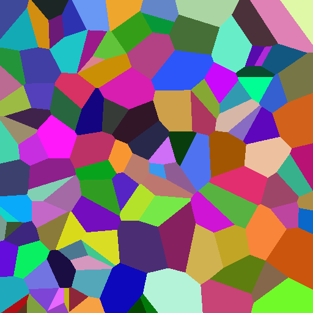
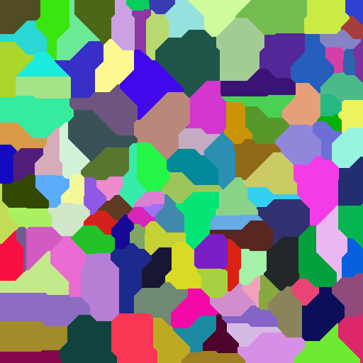
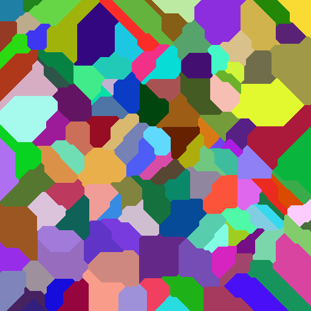

# Voronoi

## What?

**Voronoi** is a school project about [Voronoi Diagram](https://en.wikipedia.org/wiki/Voronoi_diagram).
The goal is to create a random Voronoi diagram using multiple distance algorithms.

### Compilation

**Requirements:**
- CMake (>= 3.0)
- gcc (C++ >= 17)
- OpenCV

**Steps:**
1. `cd Voronoi`
2. `cmake ./CMakeLists.txt -B ./output/`
3. `cd output/`
4. `make`

`Voronoi` executable file is in the `output` folder.

## Usage

`Voronoi {DistanceAlgorithm} {Width} {Height} {RandomPointCount}`

Available distance algorithms:
- 0 = Euclidean `Sqrt((x1 - x2)²+(y1-y2)²)`
- 1 = Manhattan `|x1-x2|+|y1-y2|`
- 2 = Chebyshev `Max(|x1-x2|,|y1-y2|)` 

### Examples

`Voronoi 0 512 512 128`

`Voronoi 1 512 512 128`

`Voronoi 2 512 512 128`

